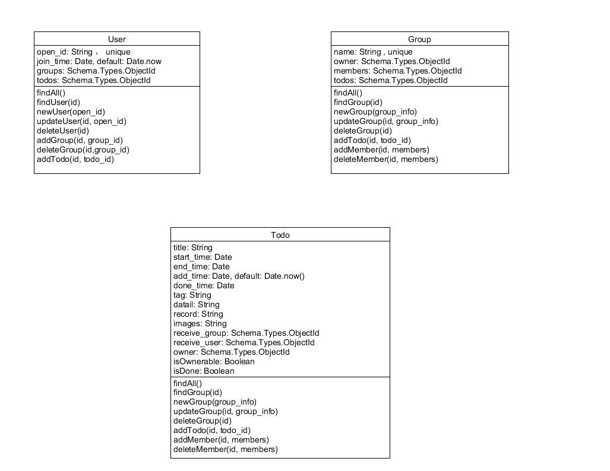
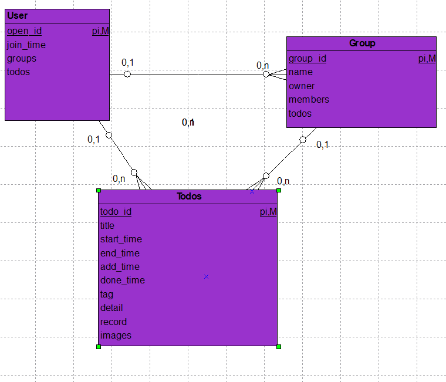

# 数据库模型

## 非关系型数据库

本次项目我们小组采用的数据库是MongoDB，故数据库类型是非关系型数据库，采用的存储方式是Key-Value型存储。

## 系统数据库原型设计

以下图包含了用户、todo、group系统数据库原型设计:

## 类E-R关系逻辑模型

MongoDB数据库介于关系数据库及非关系数据库之间，故此项目的数据库不存在真正意义上的E-R关系逻辑模型，以下是类E-R关系逻辑模型:

