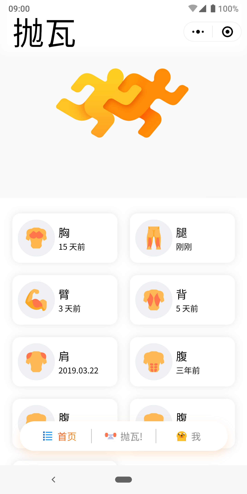
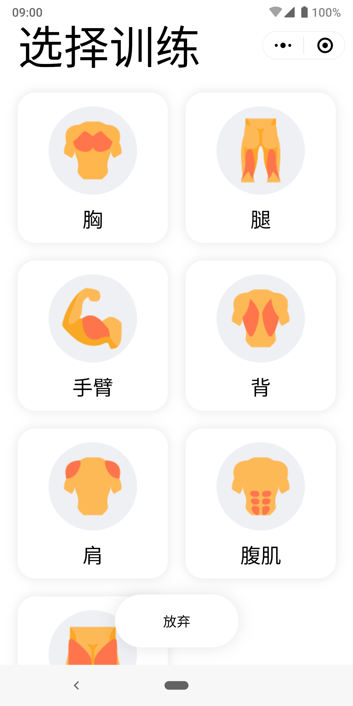
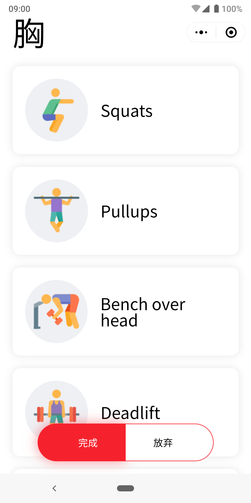
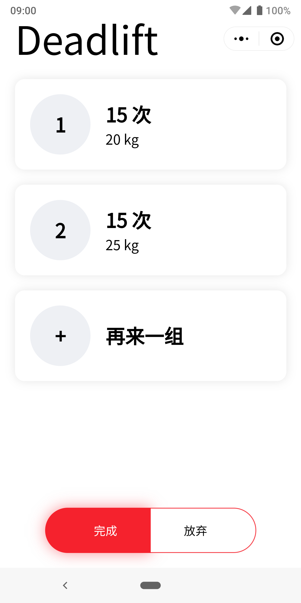
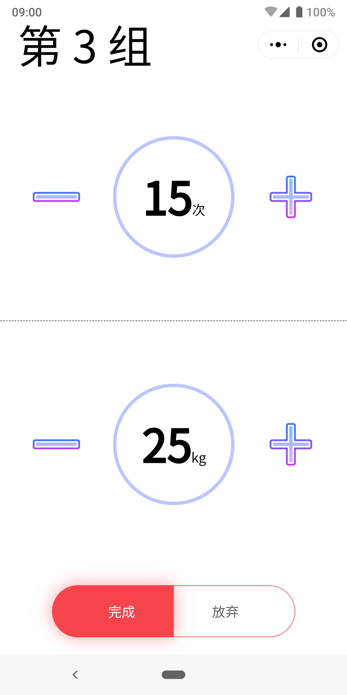
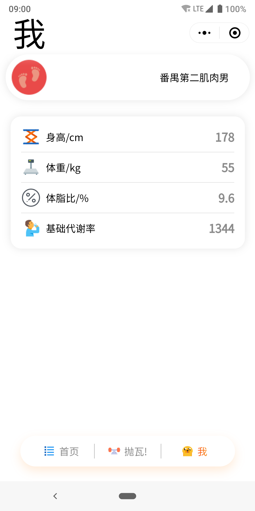

# UI设计更新日志

## 小程序首页

小程序首页显示的是用户曾经的训练记录，有辅助用户合理调整和选择训练的功能

## 训练详情页

点击首页下方的抛瓦，可进入训练选择详情页:

用户可以根据要训练的部位，在选择页点击不同的条目，即可进入相应的训练详情页。

在每一个不同的训练详情页里面，都会有针对该条目的多种训练动作，用户可以选择某个动作，自定义每一组动作的强度和数量，以及总的动作组数

定制详情页:

最后，在用户详情页，用户可以查看自己的个人身体信息如身高、体重、体脂率等指标，这也是辅助用户更好的健身的功能之一。

