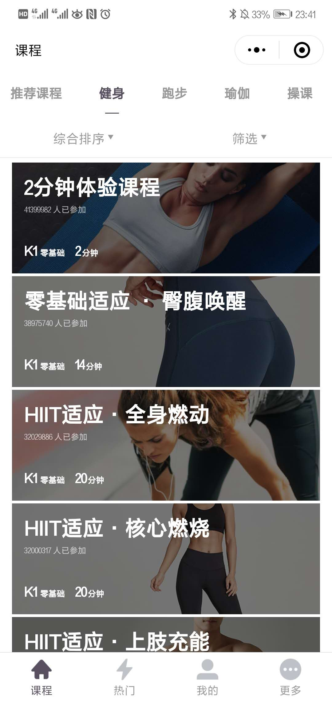
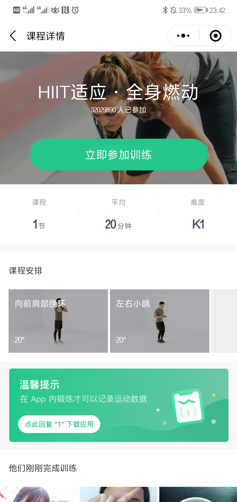
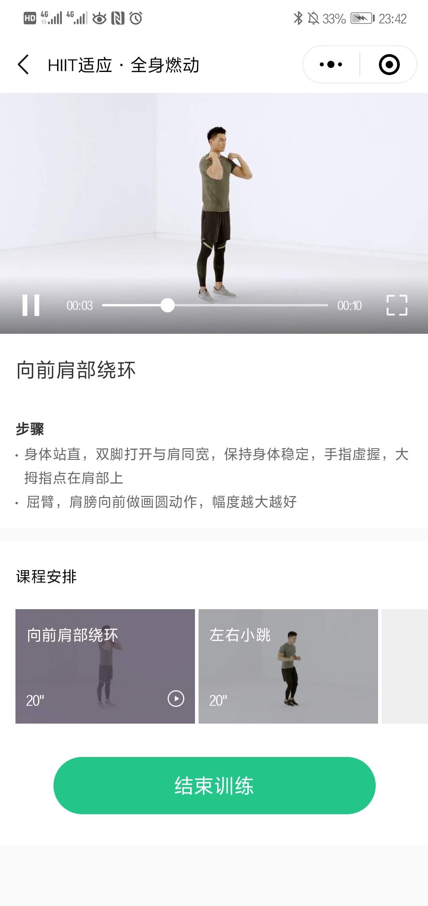
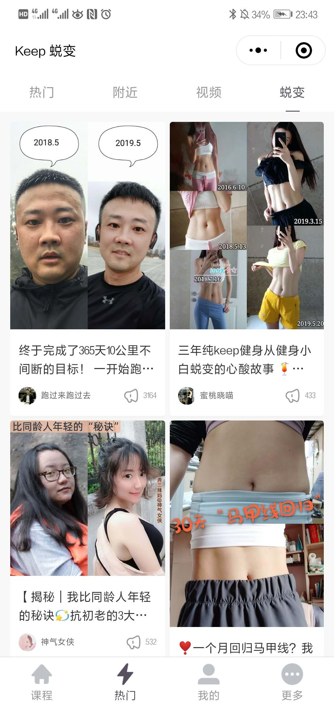
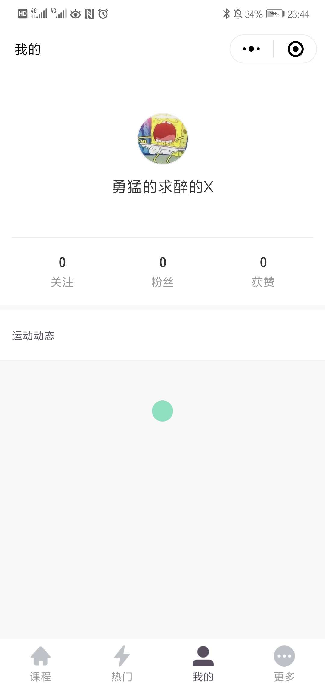

# 产品调查报告

## 1.手机健身应用的发展综述

随着全民健身上升为国家战略，以及去年马拉松，跑步等赛事的大热兴起，健身己经成为一种新的生活方式，在互联网+的影响下，健身领域也搭上互联网的顺风车，运动健身类手机应用作为最契合的载体，受到了众多互联网创业公司的靑睐。随着互联网的普及和各类运动健身类手机应用，体育社交类手机应用的涌现，各类新型健身团体应运而生，为人们健身带来多元化组织形式，交流空间和鞭策动力。结合着微信小程序这一灵活、简单的形式，人们通过网络召集，自我监控，微信晒图，为传统的运动方式注入了鲜活的生命力，徒步，跑步等健身运动已经不再是简单的体育运动，而是一种与时尚相结合的生活方式。

## 2.值得关注的竞争产品及其竞争优势

* 硬老师：一款健身减肥运动平台，为用户介绍各种健康有效的运动方式，不管是锻炼还是减肥都能达到很好的效果。其优点是能帮用户明确锻炼的目标，根据用户目标推荐响应的运动方式；另外，还能帮助用户计算运动时间和运动消耗量。

* 闪电健身：一款能为用户提供定制化健身方案的小程序，可根据用户自身身体数据帮助用户定制锻炼计划；它提供了多种动作示范给需要的用户以参考；另外，它每天还会推荐各种健身文章传递给用户正确的健康观念和身体保养小知识。

## 3.相关产品的市场定位

经过对相关产品的调研发现，此类产品主要致力于提供健身教学、跑步、骑行、交友及健身饮食指导、装备购买等一站式运动解决方案，所有追求健康、对运动有兴趣的人都是此类产品的潜在用户。

## 4.竞品的典型业务、核心界面

这里分析市面上一款产品的典型业务，以及核心界面，主要业务包括：

1.浏览各类课程

2.用户点击某个课程进入课程详细信息界面
        
3.用户选择喜欢的课程进行学习
        
4.用户可点击热门栏目看到各类短视频和其他用户的使用动态
        
5.用户可在自己主页查看的运动动态

    
具体产品界面如下：

从以上的界面可以看出，该产品的UI界面设计很优美，基本功能也基本完善，必要信息显示得当，但是经过小组讨论，我们认为还能存在以下改进：
   

1.UI设计的色调可以再更偏暖色调一点，这样会给人带来更加充满能量、想要锻炼的欲望。
    
2.在课程界面中，虽然用户可以自己选择自己感兴趣的课程并进行学习，但是该款程序还是做不到可以让用户随心所欲的定制自己的运动计划，只是列出所有的课程会给用户一种无从切入的盲目之感。

3.虽然该款程序的用户交流界面已经做的很完善，但是用户之间可交流的程度还是不够深入，我们认为，健身是一种新时代的新型交流方式，为何不能做出以“健身”会友的独特功能呢？

## 5.可能的新机遇

一个好用的健身小程序带给用户的使用体验应该是操作方便、快捷而不复杂，能把必要的信息显示清晰，布局安排合理；健身的根本是为了更好的掌控自己，那么对于用户来讲，决定自己的健身计划是一个非常重要的环节，我们希望通过自由、随性的功能设计透露出一种健身就应该是自由而充满活力的这样一种讯息给用户。所以，我们认为可以通过以下几个方面来提高用户竞争力：

1.UI设计采用偏暖色调，暖色调能给人以活力和能量，加强用户健身的动力。
    
2.提供给用户定制化健身计划的功能，用户可自主决定自己需要什么的健身训练

3.加强用户之间的互动和深入交流，打造良好生态的云健身社区