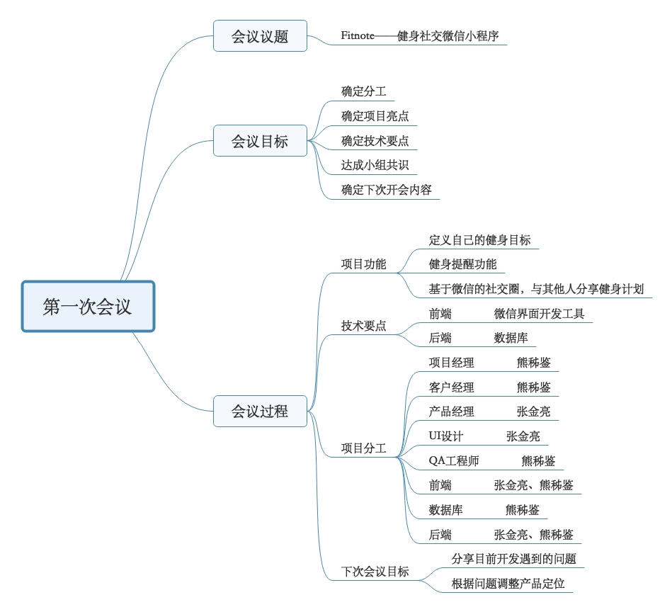
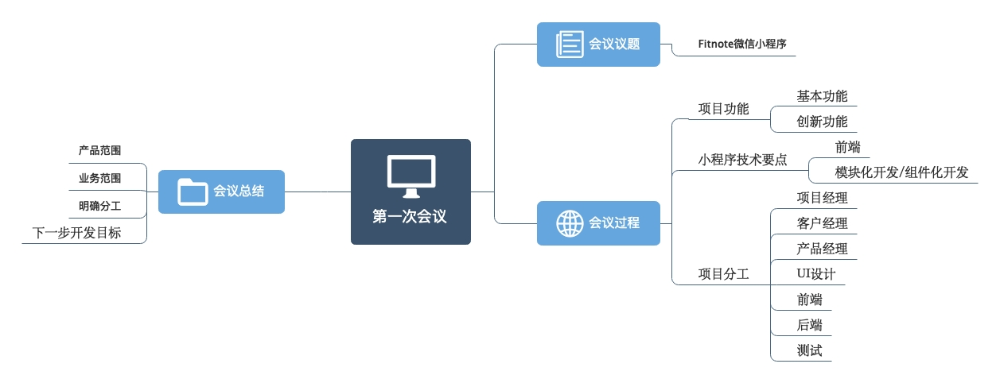

# 项目启动会议

## 一款健身和社交结合的微信小程序

会议目标：定义产品范围、愿景和核心业务，会议流程及讨论内容

* 介绍产品调查结果
  * 随着人们的生活质量逐渐提高，绝大多数人开始追求健康快乐的生活，由此一来，健身成为了人们在闲暇的生活中一个不错的选择。市场上已经有一些健身APP在推广了，如Keep、马甲线、轻加减肥、减肥瘦身等，，但是它们也存在着一定的缺陷。例如不够直接，现有的各种健身APP所呈现的界面内容过于丰富，作为一个使用者来说，是根本不需要这么多功能的，所以会产生一定的抗拒和厌烦心理；另外，现有APP的功能和所显示的内容都是在固定的位置固定刷新的，但是对于用户来说，只有自己才知道什么才是自己最想要的，所以无法定制也是现有APP一个很大的短板。

* 产品讨论:
  * 工具：MindMaster(思维导图类)
    * 每个人用思维导图记录会议内容。组织、发现会议的逻辑；控制会议的内容，在内容发散与聚焦之间找平衡；重点标识符勾出你认为（贡献人含自己）最有价值的要点与冲突。
   * 确定产品名称: FitNote
    * 定义产品范围：一款面向微信用户的简洁直接、可定制化的并且带有社交和分享等功能的健身微信小程序
    * 业务范围：
      * 用户对健身内容及健身计划的自我定制
      * 打造健身为主要内容的社交功能
      * 微信好友之间的健身内容分享 
      * 健身小程序对用户每天的任务提醒
    * 创新点凝练:
      * 小程序提供多种可供用户自己DIY的健身功能，用户可自主选择适合自己的健身内容
      * 用户可以和自己的微信好友分享自己的健身动态，用户不再是孤独的个体，而是和自己的微信好友组成了自己的小团体，使得小程序的内涵更加丰富。
      * 界面简洁，功能干练，给用户清爽、舒适之感
* 定义产品 ，按用户，利益、业务故事名称定义产品的服务范围（6~8个业务）以及第一版本backlog
* 分析涉及的相关技术与潜在风险
* 项目经理分派任务

## 记录会议思维导图

By XZJ

By ZJL