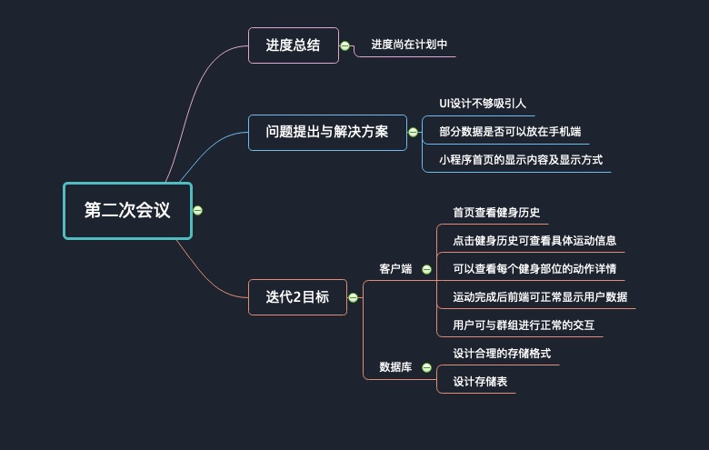

# Inception2

小组于2019年5月20号开启第二次会议，目的在于总结目前的开发进度，发现问题并提出解决方案，开启下一个迭代周期，确认下一个迭代周期的目标。

## 进度总结

目前各个方面的进度都尚且还在把控当中，项目进度完成情况：目前为止，每周各个岗位的人员都尚且能够按时完成任务。每周都能够写自己的周报kanban，总结自己一周的进度，并且安排自己下一周需要完成的事。由于目前进度尚且能够按照规划完成，因此项目经理不打算加快开发进度，按照目前的速度继续开发即可。

## 问题提出与解决

* 问题1: 目前的UI设计偏向传统，感觉其美观程度和吸引力都存在不足
* 解决1: UI设计师需要根据目前的健身小程序，进一步的学习模仿，修改已有的设计方案，让其看起来更加的和谐活泼，调动用户的运动动力。感觉要避免使用冷色调的配色，应该使用暖色调的配色，不要只使用白色+暖色的搭配，可以稍微再丰富一点，但是不要太花。

问题2: 人员目前开始搭建了微信小程序的初始框架。不知道是不是部分数据可以直接存在手机端的数据库上，减少网络交互带来的延迟。
解决2: 根据讨论结果可得，例如部分用户个人信息可以考虑放在手机端。如果没有再从服务端请求。但是这里需要保证客户端的数据和服务器端数据的一致性。需要定期更新，或者后期发现更大的问题，可能还是需要每次都从服务端取。

问题3: 在微信小程序的首页设计中，需要显示用户的健身历史吗？显示的话，按照什么样的显示方式呢？
解决3: 根据队员讨论结果，目前的解决方案是根据时间顺序从最近的到最早的显示用户的健身历史，点击每一次历史记录可以看到具体的健身信息。

## 下一迭代周期目标

现在是第12周，开启第二个迭代周期，经过前期的产品调研和以及规划，目前产品的定位和创新点都已经基本确定。UI基本设计也已经准备好了，可以开始实现产品的基本功能。这一阶段需要实现的产品功能有：

客户端：

* 进入小程序首页，能够点击健身历史，查看用户详细运动数据
* 能够查看各个健身部位的动作详情显示，并且加入计划。详情包括：一组内动作次数、运动强度包括器械类型和器械重量
* 完成运动后，前端能够正确显示用户的运动数据
* 用户能够和运动群组进行正常交互

数据库：

* 数据库设计合理的存储格式，存储所有信息

思维会议导图：

by XZJ

