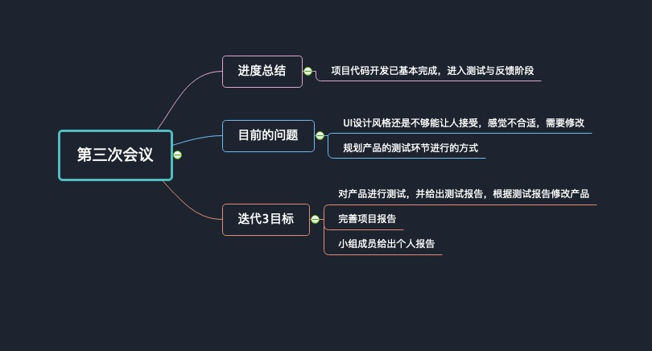

# Inception3

小组于2019年6月15号开启第三次会议，目的在于总结目前的开发进度，发现问题并提出解决方案，开启下一个迭代周期，确认下一个迭代周期的目标。

## 进度总结

目前项目开发基本完成，基本的UI界面开发已经完成，技术人员已经根据UI界面设计开发小程序，并对需求文档中的各个功能与需求逐一实现。目前产品进入测试阶段，下一迭代周期就是根据测试报告以及使用体验修改产品，最终产品开发完成。

## 问题总结

* 问题1:  UI设计的修改之后，感觉整体风格很不是很好，还是依照某个app的设计模式再修改一下吧
* 解决1: UI设计师需要根据已有的健身应用，修改当前的小程序UI设计。

* 问题2: 目前项目开发大部分已经完成，如何进行测试环节呢？
* 解决2: 根据讨论结果得出，首先是QA工程师进行产品的黑盒测试与性能测试，然后由小组内的成员使用该小程序，根据使用体验给出意见，开发人员根据测试报告修改项目代码。

## 下一轮的迭代目标

现在是第16周，开启第三个迭代周期，经过前期的项目功能实现，目前进入产品的使用测试阶段。

* QA工程师对产品进行测试，给出测试报告，测试需要兼顾到小程序的基本功能正常运行以及不同平台上的性能兼容等。
* 小组成员体验项目开发的微信健身小程序，根据使用体验将建议反馈给QA工程师，再统一反馈给开发人员，开发人员根据测试报告修改项目代码。
* 完善项目相关文档，小组成员还需要完成个人项目报告。

## 思维会议导图

By XZJ

